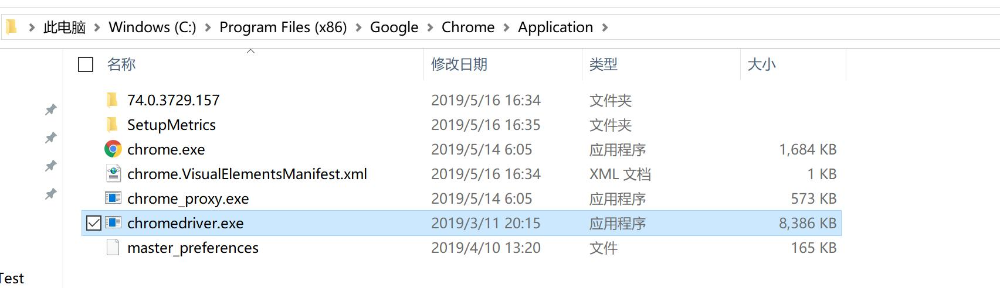

# GUI test

### 配置selenium

由于直接从Libraries添加`selenium-server-standalone`出现无法下载的错误，于是在`pom.xml`中添加了如下依赖，并让IDEA自动导入

```java
<dependency>
    <groupId>org.seleniumhq.selenium</groupId>
    <artifactId>selenium-java</artifactId>
    <version>2.53.0</version>
</dependency>
```

由于使用Chrome作为本次测试的浏览器，需要下载对应版本的chromedriver驱动文件，下载链接为<http://chromedriver.storage.googleapis.com/index.html>。我的chrome版本为74.0.3729.157，于是下载了74.0.3729.6文件夹下的chromedriver。将解压得到的文件放到chrome浏览器的路径下，如：



然后在项目中根据上面的路径配置chromedriver

```java
System.setProperty("webdriver.chrome.driver", 
		"C:\\Program Files (x86)\\Google\\Chrome\\Application\\chromedriver.exe");
```

selenium便可以使用了。